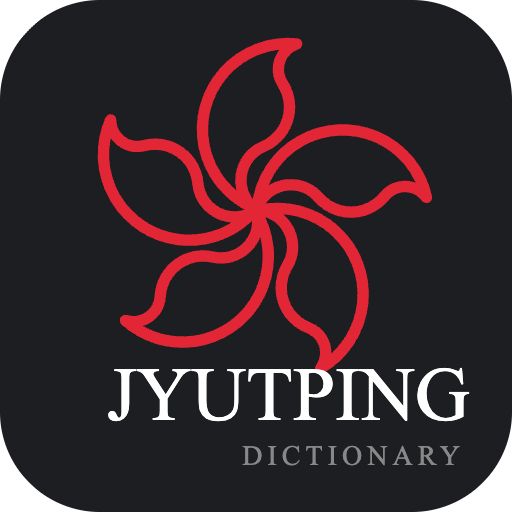
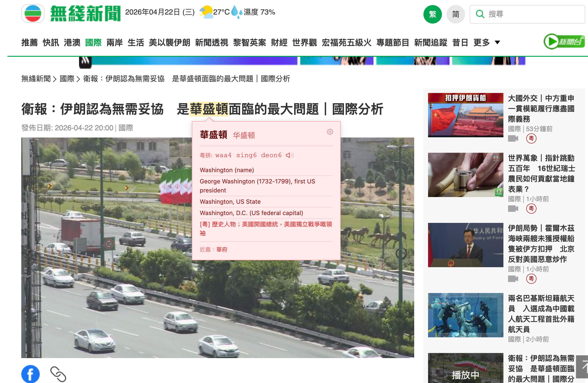
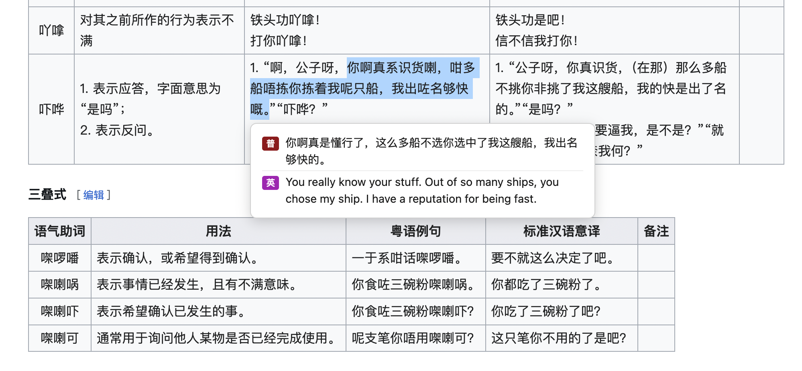
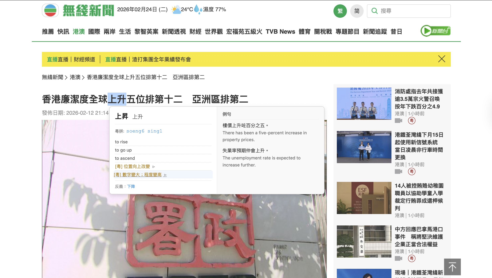
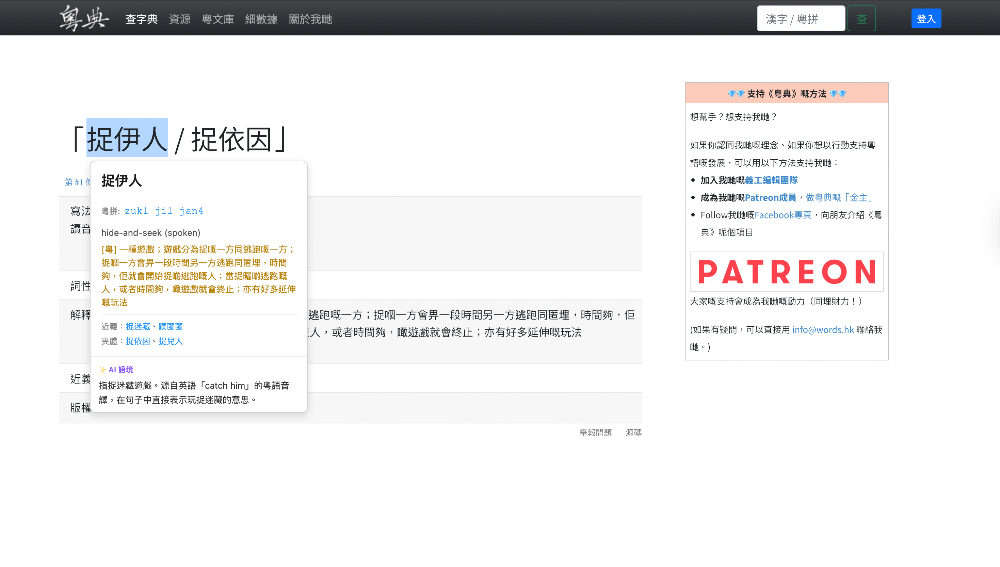
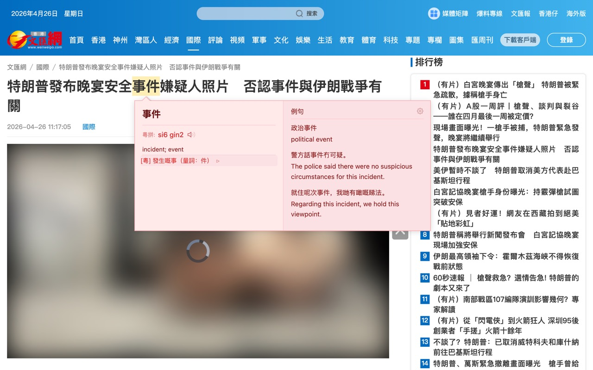

<p align="center">
  
</p>
<p align="center">
  <strong>繁體中文</strong> | <a href="README_EN.md">English</a>
</p>

# 粵語懸浮詞典 (Cantonese Popup Dictionary)

一個 Chrome 擴展，滑鼠懸停即可顯示中文字詞的粵語發音（粵拼/Yale）和英文釋義，支援多種語音引擎點擊發聲，並提供 Bing 翻譯和 AI 語境翻譯功能。








## 功能特點

- **滑鼠懸停即時查詞**：將滑鼠移到任何中文字上，即刻顯示粵語發音
- **雙拼音系統**：支援粵拼 (Jyutping) 和 Yale 兩種標註方式
- **英文解釋**：提供詳細英文翻譯和釋義
- **超過 23 萬詞條**：涵蓋常用詞彙、成語、俚語
- **點擊發聲**：點擊高亮文字即可朗讀粵語發音
- **Bing 翻譯**：雙擊選中文本，即時顯示普通話和英文翻譯
- **AI 語境翻譯**：長按高亮詞或選區，AI 根據上下文語境解釋詞義
- **多主題彈窗**：8 種精選主題（經典、香港紅、深邃夜色、水墨、海洋、暖陽、薄荷、毛玻璃）
- **多語言介面**：支援繁體中文和英文切換
- **互動式設定頁面**：新增高保真 CSS 動畫演示，輕鬆掌握「雙擊翻譯」、「長按 AI 翻譯」及「單擊發聲」的操作姿勢
- **排版隔離升級**：採用嚴格的 CSS 隔離技術，防止宿主網頁樣式污染，確保懸浮窗排版與字體大小始終如一
- **Shadow DOM 支持**：兼容使用 Web Components 的現代網站（如 Bilibili）

## 語音引擎 (TTS)

支援 4 種語音引擎，滿足不同使用場景：

| 引擎 | 需要配置？ | 音質 | 費用 |
|------|----------|------|------|
| **Chrome TTS** | 免配置 | ★★★ | 免費 |
| **Edge TTS** | 免配置（預設伺服器）/ 可自定義 | ★★★★ | 免費 |
| **Azure Speech** | 免配置（預設 API）/ 可用自定義密鑰 | ★★★★★ | 預設免費 / 自定義按量付費 |
| **Bert-VITS2** | 需填伺服器地址 | ★★★★ | 取決於服務商 |

### Azure Speech 音色

Azure Speech 提供 3 種高品質粵語音色：

- **曉曼 HiuMaan**（女聲）
- **曉佳 HiuGaai**（女聲）
- **雲龍 WanLung**（男聲）

### 語速調節

所有引擎均支援 0.5x ~ 1.5x 語速調節。

### 音頻緩存

內建智能音頻緩存（最多 20 條），重複點擊同一個詞時無需重新請求 API，實現即時播放。

## 翻譯功能

### Bing 翻譯（免費，免配置）

選中粵語文本後**雙擊選區**，即時顯示普通話和英文翻譯。使用 Bing 翻譯引擎，原生支持粵語，無需 API Key。

- 並行請求：同時翻譯為普通話和英文，速度快
- Token 優化：並發請求共享同一個 Token，避免重複獲取

### AI 語境翻譯（需配置 API）

在高亮詞或手動選中文本上**長按約 0.5 秒**，AI 會根據上下文語境，用繁體中文解釋該詞在句中的具體含義。

#### 使用方法

1. 在設定頁面開啟「AI 語境翻譯」
2. 填寫 API 配置（見下方）
3. 在網頁上懸停高亮一個詞 → **長按 0.5 秒** → AI 分析結果顯示在彈窗中
4. 或手動選中文本 → 在選區內**長按 0.5 秒** → AI 分析結果顯示在浮窗中

#### API 配置

採用統一的 **OpenAI 兼容 API 格式**，只需填寫 3 個欄位，即可適配所有主流 AI 服務商：

| 欄位 | 說明 | 示例 |
|------|------|------|
| **API Base URL** | 服務端點地址 | `https://api.deepseek.com` |
| **API Key** | 你的 API 密鑰 | `sk-xxxxxxxx` |
| **模型名稱** | 使用的模型 | `deepseek-chat` |

#### 支援的 AI 服務商

| 服務商 | API Base URL | 模型示例 |
|--------|-------------|----------|
| **OpenAI** | `https://api.openai.com/v1` | `gpt-4o-mini` |
| **DeepSeek** | `https://api.deepseek.com` | `deepseek-chat` |
| **火山引擎** | `https://ark.cn-beijing.volces.com/api/v3` | `ep-xxxx`（Endpoint ID） |
| **Ollama（本地）** | `http://localhost:11434/v1` | `gemma3:4b` |
| **Groq** | `https://api.groq.com/openai/v1` | `llama-3.3-70b-versatile` |

> 任何兼容 OpenAI `/chat/completions` 接口的服務均可使用，包括各種自建代理和中繼服務。

#### AI Prompt 設計

系統會自動提取選中詞語所在的段落作為上下文，發送如下 Prompt 給 AI：

```
你是一個粵語語言專家。用戶在閱讀粵語文章時選中了一個詞語，
請根據上下文語境，用繁體中文簡要解釋這個詞在句中的具體含義（1-2句話）。
只需要回覆解釋內容本身，不需要任何格式標記。

【詞語】{選中的詞}
【句子】{所在段落文本}
```

## 操作指南

| 操作 | 觸發方式 | 效果 |
|------|---------|------|
| 查詞 | 滑鼠懸停中文字 | 彈窗顯示粵拼、Yale、英文釋義 |
| 朗讀 | 點擊高亮詞 / 點擊彈窗音標 | TTS 朗讀粵語發音 |
| Bing 翻譯 | 選中文本 → 雙擊選區 | 顯示普通話 + 英文翻譯 |
| AI 語境翻譯 | 在高亮詞或選區上長按 ~0.5 秒 | AI 根據語境解釋詞義 |
| 展開例句 | 點擊懸浮窗英文釋義 | 查看更多例句和詳細解釋 |

## 安裝

<a href="https://chromewebstore.google.com/detail/%E7%B2%B5%E8%AA%9E%E6%87%B8%E6%B5%AE%E8%A9%9E%E5%85%B8/nkghannminfkihhnkebcjhodfcoamkkm" target="_blank">
  
</a>
&nbsp;&nbsp;
<a href="https://microsoftedge.microsoft.com/addons/detail/%E7%B2%B5%E8%AA%9E%E6%87%B8%E6%B5%AE%E8%A9%9E%E5%85%B8/akejhmlcbfmnoodfibchikfjkgjjbfpc" target="_blank">
  
</a>

### 手動安裝
1. 下載或 Clone 本倉庫
2. 打開 Chrome，進入 `chrome://extensions/`
3. 開啟右上角的「開發者模式」
4. 點擊「載入未封裝項目」
5. 選擇項目資料夾

## 設定

點擊擴展圖標 → 更多設定：

### 一般設定
- **啟用 / 關閉詞典**
- **發音格式**：粵拼 (Jyutping) / Yale
- **彈窗主題**：經典 / 香港紅 / 深邃夜色 / 水墨 / 海洋 / 暖陽 / 薄荷 / 毛玻璃

### 翻譯設定
- **Bing 翻譯**：免費免配置，雙擊選區觸發

### AI 語境翻譯設定
- **啟用開關**：開啟/關閉 AI 翻譯
- **API Base URL**：OpenAI 兼容接口地址
- **API Key**：服務商密鑰
- **模型名稱**：選用的 AI 模型
- **測試連接**：一鍵驗證 API 配置是否正確

### TTS 語音設定
- **語音引擎**：選擇 TTS 服務提供商
- **語音音色**：Azure Speech 可選擇不同音色
- **語速調節**：0.5x ~ 1.5x
- **Edge TTS / Azure Speech**：支援預設伺服器（免配置）或自定義地址/密鑰

## 數據來源

- [words.hk](https://words.hk/) - 粵語開放詞典
- [CC-Canto](https://cantonese.org/) - 粵語詞典
- [CC-CEDICT](https://cc-cedict.org/) - 中英詞典
- [PyCantonese](https://pycantonese.org/) - 粵拼補充

## 隱私政策

本擴展不收集任何用戶數據。AI 翻譯功能使用用戶自己配置的 API，數據直接發送至用戶選擇的 AI 服務商，不經過任何中間伺服器。詳見 [隱私政策](privacy-policy.html)。

## 授權

本項目採用 [GNU General Public License v3.0](LICENSE) 授權。

## 貢獻

歡迎提交 Issue 和 Pull Request！

## 聯繫

如有問題或建議，請通過 GitHub Issues 聯繫。
